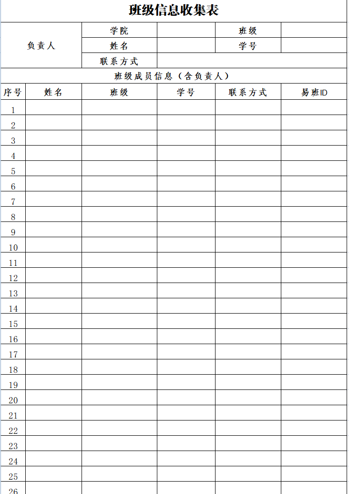

# 综测软件策划案

## 需求分析：

- 综测表作为校易班活动的数据收集表格，在对参加活动人员的活动综测分数统计具有巨大意义。但是由于综测表使用人工制作时，非常耗费人力时间。占据易班人员大部分的活动时间，因此想要制作一款软件，解决这些情况。制作完毕想必非常有意义，减少易班人员的工作时间，提升效率。

## 软件功能：

- 分析： 根据我一年半在易班的经验，综测表的制作类型大致可以分成2类。
  - 第一类： 该活动参赛人员收集是通过小程序，轻应用等，导出的表格就**已经收集了所有的人员信息**。
  - 第二类： 该活动是以小组的形式参加，每个小组都会填写一个**报名表**，然后需要提取所有小组人员然后制作成综测表。
    - 表格图片：
- 功能：分别能解决两种综测表的制作，最终导出的直接就是符合要求的综测表

### 细节功能

- 在制作综测时，需要分步完成：
  - 原因： 在第一步筛选关键信息（筛选所需数据（名字和学号），数据不够则报错）后，需要对原表格关键数据进行查找综测信息（名字，学号，学院，专业班级）。但是我们不能保证原表格的参赛个人填写的信息完全正确，所以就会出现找不到相关数据的情况发生，或者找到的数据与原数据冲突等情况。这个时候就需要我们自行解决问题，修正原表格数据后再次筛选。
    - 软件需要将出错或有异议的数据提取出来
- 下一步就是填写相关固定选项，例如活动名称、文本类型、活动综测分（获奖和不获奖）、获奖名单。
- 获奖名单：需要是excel表格，第一栏获奖人/队伍，第二栏奖励的综测分，第三栏获奖名次（两种类型、写法不一致）

### 额外要求

- 有个预览键可以预览当前文件处理的数据

- 需要对用户保存的数据进行存储，即使用户退出软件，当重新进来时不用重新开始。